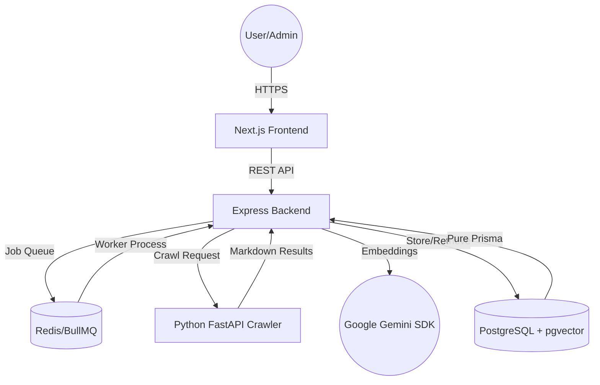

# ChatEmbed System Architecture & Code Flow

This document provides a detailed overview of how the ChatEmbed platform is structured, how its services communicate, and how the core logic (Crawling, Indexing, and Chatting) works.

## 1. High-Level Architecture

The system consists of three main services:

1.  **Frontend (Next.js)**: The administrative dashboard and the chat widget.
2.  **Backend (Express/Node.js)**: The central orchestrator, managing the database, authentication, and job queues.
3.  **Crawler (FastAPI/Python)**: A high-performance web crawler using `crawl4ai` to transform websites into clean Markdown.

### Service Communication Map

---

## 2. Core Service Responsibilities

### Express Backend (`express-backend`)
- **API Surface**: Handles all requests from the dashboard (auth, chatbot management, analytics).
- **Orchestrator**: When a new chatbot is created, it enqueues a "Crawl Job" in BullMQ.
- **Data Processor**: Once the crawler returns Markdown, the backend breaks it into chunks, generates semantic embeddings via gemini/voyage, and stores them in PostgreSQL.
- **RAG Engine**: During chat, it performs hybrid search and feeds context to the LLM.

### Next.js Frontend (`nextjs-frontend`)
- **Dashboard**: Where users configure their bots, view analytics (Insights/Gaps), and manage knowledge sources.
- **Widget**: A lightweight JS snippet that can be embedded on any site to provide AI chat.

### Python Crawler (`python-crawlling-backend`)
- **Specialized Scraper**: Uses `crawl4ai` and `BeautifulSoup` to handle difficult sites (JS-heavy, SPAs).
- **Output**: Returns structured Markdown that is optimized for LLM consumption.

---

## 3. Database Schema Walkthrough

The project uses **Prisma** to interact with a PostgreSQL database.

| Model | Purpose |
| :--- | :--- |
| **User** | System administrators who own organizations. |
| **Organization** | A container for multi-tenant access control. |
| **Chatbot** | The AI entity with its own configuration (prompt, name, colors). |
| **CrawlPage** | Metadata for a specific URL or uploaded document. |
| **Chunk** | The actual text fragments + their **vector embeddings**. |
| **Conversation** | A session-based container for messages. |
| **Message** | Individual user questions and AI answers. |
| **MissedQuery** | Analytics data for queries where the bot had low confidence. |

---

## 4. Operational Flows

### A. The Knowledge Ingestion Flow
1.  **Trigger**: User enters a URL or uploads a PDF.
2.  **Queue**: Backend adds a job to the `crawl-queue` (Redis).
3.  **Discovery**: Crawler finds all internal links within the domain (up to `pageLimit`).
4.  **Transformation**: Crawler converts HTML to clean Markdown.
5.  **Splitting**: Backend receives Markdown and uses `src/utils/chunking.ts` to split text into ~1000 character pieces.
6.  **Vectorization**: Each chunk is sent to the Embedding API.
7.  **Storage**: The chunk and its 1024-dimension vector are saved in the `Chunk` table.

### B. The Chat / RAG Flow
1.  **Query**: User asks "How much does the Basic plan cost?".
2.  **Search**: `src/services/search.service.ts` converts the query to a vector.
3.  **Similarity**: PostgreSQL performs a `vector <=> similarity` search to find the 5 most relevant chunks.
4.  **Confidence**: If the best match score is < 0.72, it's logged to the **MissedQuery** table.
5.  **Prompting**: The chunks are injected into a system prompt: *"Use this context to answer: [context] Question: [query]"*.
6.  **Response**: The LLM generates a natural language answer.

---

## 5. Key Technologies
- **Prisma**: Object-Relational Mapping (ORM) used for all database interactions.
- **pgvector**: PostgreSQL extension for storing and searching high-dimensional vectors.
- **BullMQ**: Distributed job queue for long-running crawling/indexing tasks.
- **LangChain**: Used for document management and vector store abstractions.
- **Google Gemini**: Powers the core LLM reasoning.
- **Voyage AI**: Generates state-of-the-art text embeddings.
