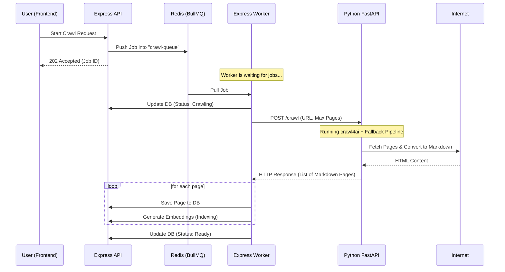

# Learning Python Architecture & BullMQ Integration

This guide explains how the Python service works and how it integrates into the broader application ecosystem (specifically with the Express backend and BullMQ).

## 1. The High-Level Flow (The "Big Picture")

Even though you are writing Python code, the Python service doesn't live in a vacuum. It is part of a **Distributed System**.



---

## 2. Python Core Concepts Used Here

### A. FastAPI & Uvicorn
- **FastAPI**: The web framework used in `main.py`. It's fast, modern, and handles JSON validation automatically using **Pydantic**.
- **Uvicorn**: The "Server" that runs the FastAPI app. It handles the low-level HTTP connections.

### B. Asynchronous Programming (`async`/`await`)
Web crawling is "I/O bound" (you spend most of your time waiting for the internet). 
- `async def`: Defines a function that can "pause" without blocking the whole program.
- `await`: Tells Python to pause here until the operation (like fetching a URL) is done.
- `asyncio.gather()`: Runs multiple tasks at the same time (parallelism).

### C. Pydantic Models
Look at `CrawlRequest` and `CrawlResponse` in `main.py`. These define exactly what the API expects and what it returns. If the Express backend sends the wrong data, FastAPI will automatically reject it with a `422 Unprocessable Entity` error.

---

## 3. The Python Crawling Internal Pipeline

The Python service has two ways to crawl:
1. **The Fast Way (`crawl4ai`)**: Uses a headless browser to "see" the page like a human. This is great for Javascript-heavy sites (React, Vue, etc.).
2. **The Robust Way (`scraper/pipeline.py`)**: A custom 4-tier pipeline that uses fallback fetchers (like `httpx`) if the browser fails or gets blocked.

### Key Files in `scraper/`:
- `browser_fetcher.py`: Uses Playwright/Puppeteer logic via `crawl4ai`.
- `http_fetcher.py`: Fast, raw HTTP requests (for sites that don't need JS).
- `url_store.py`: Keeps track of which URLs were found (SQLite).
- `md_cleaner.py`: Cleans output for AI.

### The 4-Tier Strategy (Internal Flow)
The `pipeline.py` file uses a clever fallback strategy for every URL:
1.  **Classify URL**: Decide if it's Tier A (Easy), B (Browser needed), or C (Blocked/Sensitive).
2.  **Tier C**: Skip immediately.
3.  **HTTP Fetch (Tier A)**: Always try the fastest method first.
    - If success → extract clean markdown.
    - If blocked/failed → Move to Step 4.
4.  **Browser Fetch (Tier B)**: Use `crawl4ai` (Headless Chrome) to run Javascript and bypass simple bot-walls.
    - If blocked/failed → Move to Step 5.
5.  **Fallback Extraction**: If the page is "half-loaded", use libraries like `trafilatura` or `readability` on the raw HTML we managed to get.
6.  **Clean & Save**: Always clean the final Markdown to remove junk like navbars, footers, and ads.

---

## 4. BullMQ: The Bridge

### What is BullMQ?
BullMQ is a **Message Queue**. It's built on top of **Redis**.
- **Producers**: Create "Jobs" (The Express API).
- **Queues**: Store the jobs safely in Redis (The "Buffer").
- **Workers**: Process the jobs one by one (The Express Worker).

### Why use a Queue?
Crawling a website can take 10 seconds or 10 minutes. 
- **Without a queue**: If the user clicks "Crawl" and the browser waits 1 minute, the connection will timeout, and the user will see an error.
- **With a queue**: The user gets an immediate "Okay, I'm working on it" response. The work happens in the background.

### Can Python use BullMQ?
Currently, your project uses an **HTTP Bridge**.
- Express Worker (Node) -> HTTP Request -> Python Service (FastAPI).

**Why do it this way?**
It's easier to debug! You can test the Python service with a simple `curl` command or Postman without needing to mess with Redis.

**If you wanted Python to talk to BullMQ directly:**
You would use a library like `bullmq-python`. Instead of running a FastAPI server, you would run a Python script that connects to Redis and waits for jobs.

```python
# Example of what a Python Worker would look like (Bonus)
from bullmq import Worker

async def process_job(job):
    url = job.data['url']
    # Do crawling here...
    return {"status": "success"}

worker = Worker("crawl-queue", process_job, {"connection": "redis://localhost:6379"})
```

---

## 5. Security: The Internal Key
In `main.py`, you'll see:
```python
if x_internal_key != INTERNAL_API_KEY:
    raise HTTPException(status_code=403, detail="Forbidden")
```
This ensures that only *your* Express backend can talk to the Python service. If someone finds your Python server's IP address, they can't use it to crawl for free.

---

## Summary Checklist for Developing in Python:
1. **Define the Schema**: Update Pydantic models in `main.py` if the data structure changes.
2. **Handle Async**: Always use `await` for network and file calls.
3. **Check Logs**: The Python service prints status messages. Use `tail -f crawler.log` to see what's happening.
4. **Environment Variables**: Add your API keys (like `INTERNAL_API_KEY`) to the `.env` file in the `python-crawlling-backend` folder.
